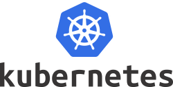

<link rel='stylesheet' href='assets/css/main.css'/>

# Kubernetes labs

## Lab Environment

Instructor will provide access to lab environment

## Labs

### Install and Setup

* __INSTALL-1__ : [Setup a single node kubernetes cluster with minikube](install-and-setup/1-minikube.md)
* __INSTALL-2__ : [Setup a multi node kubernetes cluster ](install-and-setup/2-kubernetes-cluster-setup.md)

### Exploring Kubernetes

* __EXPLORE-1__: [Get familiar with kubectl command](exploring/1-kubectl.md)
* __EXPLORE-2__: [Setup a dashboard](exploring/2-dashboard.md)

### Pods

* __POD-1__: [Running a pod](pods/1-pod-run/README.md)
* __POD-2__: [Deploying pods via manifest](pods/2-pod-manifest/README.md)

### ReplicaSet

* __REPLICASET-1__: [Deploy a ReplicaSet](replicaset/nginx/README.md)

### DaemonSet

* __DAEMONSET-1__: [Deploy a DaemonSet](daemonset/README.md)

### Resource Limits

* __RESOURCE-LIMIT-1__: [Specify resource limits](resource-limits/README.md)

### Deployment

* __DEPLOY-1__: [Basic deployment](deployments/basic/README.md) - Deploy multiple replicas of nginx
* __DEPLOY-2__: [Rollout deployment](deployments/rollout/README.md)
* __DEPLOY-3__: [Blue/Green deployment](deployments/blue-green/README.md)
* __DEPLOY-4__: [Canary deployment and A/B deployment](deployments/canary/README.md)

### Services

* __SERVICE-1__: [Deploy a service](services/nginx/README.md)

### Networking

* __NETWORK-1__: [Custom DNS settings](networking/dns/DNS.md)

### Labels

* __LABEL-1__: [Labeling Pods](labels/pod-labels/README.md)
* __LABEL-2__: [Pod placement](labels/pod-placement/README.md)

### Configurations

* __CONFIG-1__: [Create and use config maps](config-map/README.md)
* __CONFIG-2__: [Using secrets](secret/README.md)

### Volumes

* __VOLUME-1__: [Using EmptyDir scratch space](volumes/shared-volume-empty/README.md)
* __VOLUME-2__: [Sharing a persistent volume](volumes/pv-shared/README.md)
* __VOLUME-3__: [Using shared volume as nginx storage](volumes/pv-nginx/README.md)

### Sidecar

* __SIDECAR-1__: [Sidecar usage](sidecar/README.md)

### Metrics

* __METRICS-1__: [Examining Kubernetes metrics](metric-server/README.md)

### Auto Scale

* __AUTO-SCALE-1__: [Autoscaling based on resource usage](autoscale/README.md)

### Ingress and Load balancing

* __INGRESS-1__ : Setup Ingress controller (TODO)

### Practice Labs

* __PRACTICE-Lab-1:__ [Bundle and deploy a jokes server](practice-labs/joke-server/README.md)
* __PRACTICE-Lab-2:__ [Deploy Pacman and Mario video games!](practice-labs/games/README.md)
* __PRACTICE-LAB-3:__ [Deploy a wordpress application](practice-labs/wordpress/README.md)
* __PRACTICE-LAB-4:__ [Deploy RedMine application](practice-labs/redmine/README.md)