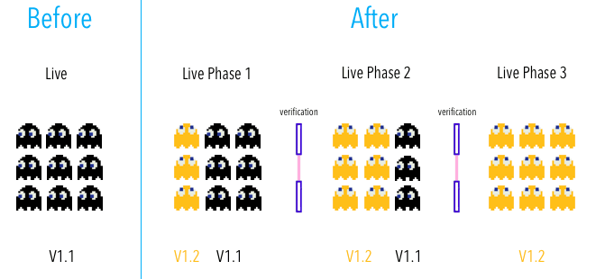

<link rel='stylesheet' href='../../assets/css/main.css'/>

# Lab - Canary Deployment  and A/B Testing

## Overview

We will exercise a 'canary' pattern



We have 2 deployments:

- v1
- v2
- service will divide traffic between v1 and v2

## Duration

30 mins

Project dir:

```bash
$   cd  ~/kubernetes/deployments/canary
```

## Step-1: V1 Deployment

Inspect [deploy-v1.yaml](deploy-v1.yaml) file

This deployment does `v1`

```bash
$   kubectl  apply -f deploy-v1.yaml

$   kubectl  get deploy -o wide

$   kubectl  describe deploy nginx-v1

$   kubectl  get pods --show-labels
```

We will see 4 pods running v1 service

## Step-2: V2 Deployment

Inspect [deploy-v2.yaml](deploy-v2.yaml) file

This deployment does `v2`

```bash
$   kubectl  apply -f deploy-v2.yaml

$   kubectl  get deploy -o wide

$   kubectl  describe deploy nginx-v2

$   kubectl  get pods --show-labels
```

We will see 4 pods running v2 service

## Step-3: Inspect Labels for Deployments

```console
NAME       READY   UP-TO-DATE   AVAILABLE   AGE   CONTAINERS   IMAGES          SELECTOR
nginx-v1   4/4     4            4           63m   nginx        sujee/nginx:1   app=nginx,version=v1
nginx-v2   4/4     4            4           63m   nginx        sujee/nginx:2   app=nginx,version=v2
```

## Step-4: Service

Inspect [service-all.yaml](service-all.yaml) file.

Notice our selector:

```yaml
  selector:
    app: nginx
```

This will select **all nginx, both v1 and v2**.  So traffic would flow to both v1 and v2 deployments.

```bash
$   kubectl apply -f service-all.yaml

$   kubectl get svc

$   kubectl describe svc nginx-service
```

**Note: Inspect the EndPoints for the service.  There should be 8 ( 4 v1 + 4 v2)**

## Step-5: Test Traffic

First get worker node's IP. (say 1.2.3.4)

```bash
$   kubectl  get  nodes -o wide
```

And access the service like this

```bash
$   curl  1.2.3.4:30100/
```

You will see nginx message.

Run the command a few times, sometimes you will see v1 message and sometimes v2.

Run the `test-service.sh`

```bash
$   ./test-service.sh
```

```bash
# count v1, v2
$   ./test-service.sh | grep v1  | wc -l
$   ./test-service.sh | grep v2  | wc -l
```

You will see both V1 and V2 messages.  Should see about 50-50 spread.

## Step-6: Let's change the traffic proportion

Let's reduce v1 traffic.

Edit `deploy-v1.yaml` and change the number of replicas from 4 to 2.

```bash
# note: replace instead of apply
$   kubectl replace -f deploy-v1.yaml
```

Inspect the deployments

```bash
$   kubectl get deploy

$   kubectl get pods
```

So now we have 2 v1 + 4 v2

**Note: Inspect the EndPoints for the service.  There should be 8 ( 4 v1 + 4 v2)**

Send some traffic

```bash
$   ./test-service.sh

# you should see more v2 than v1
# count v1, v2
$   ./test-service.sh | grep v1  | wc -l
$   ./test-service.sh | grep v2  | wc -l
```

## Step-7: Send Traffic to a Specific Version

Edit `service-all.yaml`

Change the label to 

```yaml
  selector:
    app: nginx
    version: v1
```

And update the service

```bash
# note; replace instead of apply
$   kubectl  replace -f  service-all.yaml
```

Try traffic

```bash
$   ./test-service.sh
```

You should see all traffic going to v1

Edit `service-all.yaml` again and switch all traffic to v2

### Try this out:

Edit `service-all.yaml` and set the version to v3

```yaml
  selector:
    app: nginx
    version: v3
```

Update the service and , try the test-service.sh

Do you see any results?  Why?

## Lab is Complete! 👏