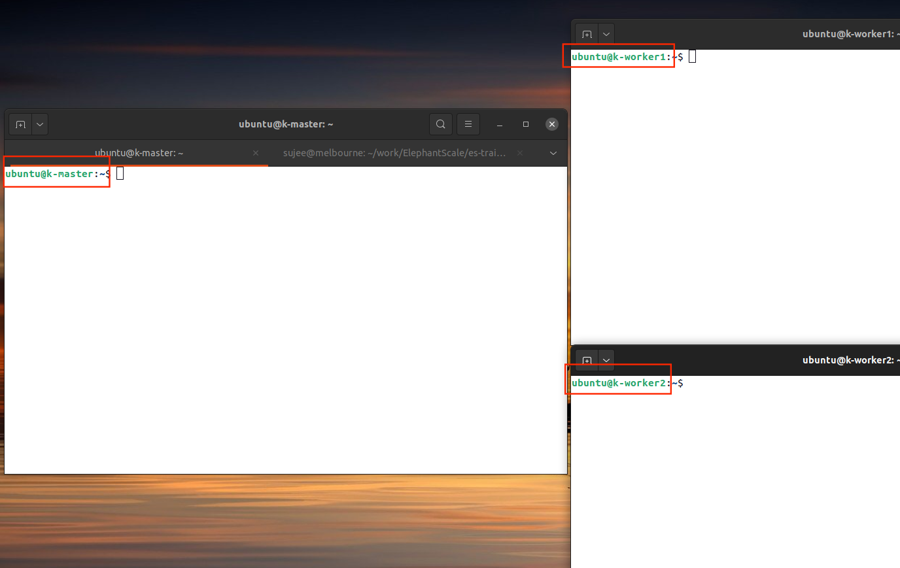
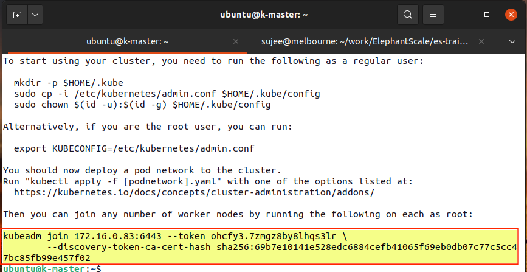

<link rel='stylesheet' href='../assets/css/main.css'/>

# Lab - Setup a Multi Node Kubernetes Cluster

## Overview

We will setup a 3 node K8 cluter (1 master + 2 workers)

## Duration

30-45 minutes

## Step-1 : Login to Machines

Each student will have 3 nodes (1 master + 2 workers)

Login details will be provided.

## Step-2: Set Hostnames

We want to make sure we have unique hostnames, so they are easy to identify.

**on master**

```bash
$  sudo hostnamectl set-hostname master

# verify by
$   hostname
```

**on worker1**

```bash
$  sudo hostnamectl set-hostname worker1

# verify by
$   hostname
```

**on worker2**

```bash
$  sudo hostnamectl set-hostname worker2

# verify by
$   hostname
```

When you set the hostname, the terminal prompt will not change.  You need to log out and log back in

**ACTION: Logout and log back in for all nodes**

By now, you should have setup like this, with 3 terminals, with appropriate hostnames :-)



(Right click on the image --> Open on new tab to see larger version)

### ProTip (Optional)

You can also change the terminal prompt (PS1) as follows:

On the terminal, execute the following code, so it will set the shell prompt.

```bash
# on master node
$   PS1_OLD=$PS1
$   PS1="MASTER : $PS1_OLD"
# you will notice the prompt change to something like this:
#     MASTER : ubuntu@ip-172-16-0-83:
```

## Step-3: Prepare Nodes for Kubernetes

Kubernetes is picky on machine settings.  Make sure to perform these steps on all nodes

###  3.1 - Turn off Swap

Kubernetes will refuse to startup, if the system is using swap memory.  Disable  swap memory on all nodes!

**on master + worker1 + worker2**

```bash
$   sudo swapoff -a
```

### 3.2 - Check Docker cgroups

**on master + worker1 + worker2**

We need to make sure docker cgroups configuration matches what Kubernetes is expecting.

```bash
$   docker info | grep -i cgroup
```

Output may look like

```console
 Cgroup Driver: cgroupfs
 Cgroup Version: 1
```

we should change cgroups from `cgroupfs` to `systemd`

```bash
$   sudo vi /etc/docker/daemon.json
```

And add the following line:

```json
{
"exec-opts": ["native.cgroupdriver=systemd"]
}
```

Save the file.

Restart docker daemons

```bash
$   sudo systemctl daemon-reload
$   sudo systemctl restart docker
```

Check cgroups now

```bash
$   docker info |  grep -i cgroup
```

Output should be

```console
 Cgroup Driver: systemd
 Cgroup Version: 1
```

**Make sure this is done on all nodes!**

<mark>**At this point reboot all your nodes, so the settings can take effect**</mark>

```bash
$   sudo reboot
```

Log back in after the reboot

## Step-4: Install Kubernetes on Nodes

**on master + worker1 + worker2**

```bash
$   sudo apt install apt-transport-https curl

$  curl -s https://packages.cloud.google.com/apt/doc/apt-key.gpg | sudo apt-key add

$  sudo apt-add-repository "deb http://apt.kubernetes.io/ kubernetes-xenial main"

$  sudo apt update

$  sudo apt install -y kubeadm kubelet kubectl kubernetes-cni
```

## Step-5: Initialize Kubernetes Master Server

**on master**

```bash
$   sudo kubeadm init --pod-network-cidr=192.168.0.0/16
```

This will take a good 1-2 minutes to complete.

<mark>**Note: Only run this init command ONCE**</mark>

If every thing goes well, you will see a message like

```console
Your Kubernetes control-plane has initialized successfully!
```

### 5.1 - Setup K8 config

`kubeadm init`  command will print out how to configure kubernetes for a non-root user account.  Execute those steps 

**on master node only**

```bash
$   mkdir -p $HOME/.kube
$   sudo cp -i /etc/kubernetes/admin.conf $HOME/.kube/config
$   sudo chown $(id -u):$(id -g) $HOME/.kube/config
```

### 5.2 - Kubeadm Join command

`kubeadm init`  will print out a join command like this:



**Note: Your command will be different.**

**ACTION: Please save your version of join command for later use**

ProTip:  
If you need to retrieve the join command later, you can run this comamnd

```bash
$   kubeadm token create --print-join-command
```

## Step 6 - Deploy Pod Network

Let's see our kubernets cluster status

```bash
$   kubectl get nodes
```

Output may look like:

```console
NAME       STATUS     ROLES                  AGE   VERSION
master   NotReady   control-plane,master   43m   v1.22.1
```

Our master node is not ready!

This is because a network setup is not complete.  Let's fix it.

The pod network is used for communication between hosts and is necessary for the Kubernetes cluster to function properly. 

References:

- [https://stackoverflow.com/questions/61811883/flannel-is-crashing-for-slave-node](https://stackoverflow.com/questions/61811883/flannel-is-crashing-for-slave-node)
- [https://stackoverflow.com/questions/49112336/container-runtime-network-not-ready-cni-config-uninitialized](https://stackoverflow.com/questions/49112336/container-runtime-network-not-ready-cni-config-uninitialized)
- [https://www.tigera.io/project-calico/](https://www.tigera.io/project-calico/)

Apply Calico network

```bash
$   kubectl apply -f https://docs.projectcalico.org/manifests/calico.yaml
```

Now check the status:

```bash
$   kubectl get nodes
```

**Note: It will take 1-2 minutes for the Calico network to initialize**

Output should be

```console
NAME       STATUS   ROLES                  AGE   VERSION
master   Ready    control-plane,master   49m   v1.22.1
```

```bash
$   kubectl get pods --all-namespaces
```

You should see pods running in `kube-system` namespace

```console
NAMESPACE     NAME                                       READY   STATUS    RESTARTS   AGE
kube-system   calico-kube-controllers-58497c65d5-hv75c   1/1     Running   0          116s
kube-system   calico-node-gtlql                          1/1     Running   0          117s
kube-system   coredns-78fcd69978-hbpbs                   1/1     Running   0          5m31s
kube-system   coredns-78fcd69978-qpsnt                   1/1     Running   0          5m31s
kube-system   etcd-master                              1/1     Running   2          5m44s
kube-system   kube-apiserver-master                    1/1     Running   2          5m44s
kube-system   kube-controller-manager-master           1/1     Running   0          5m44s
kube-system   kube-proxy-sd68v                           1/1     Running   0          5m31s
kube-system   kube-scheduler-master                    1/1     Running   2          5m44s

```

Yay!

## Step-7: Join the Worker nodes

Now it is time to join the worker nodes.

Take a note of your `kubeadm join` command.

Run that command on both worker nodes.  **Don't forget sudo**

**on Worker1 and Worker2**

```bash
#   run the command you saved from earlier step
$   sudo kubeadm join ....
```

**on master**

Check the status of cluster

```bash
$   kubectl get nodes
```

If every thing went well, you should see something like this:

```console
NAME        STATUS   ROLES                  AGE   VERSION
master    Ready    control-plane,master   74m   v1.22.1
worker1   Ready    <none>                 91s   v1.22.1
worker2   Ready    <none>                 79s   v1.22.1
```

## Step-8: Testing our Shiny Cluter

### 8.1 - Single Pod

Let's run some containers in the cluster

First Run pod as interactive shell

```bash
$   kubectl run -i --tty busybox --image=busybox -- sh

# this will drop you into busybo shell
# type a command, say ls, and see the output
    > ls
```

**Action: Keep busybox running.  Open another terminal, and try this**

```bash
$   kubectl  get pods -o wide
```

Should see some output like

```console
NAME      READY   STATUS    RESTARTS   AGE   IP                NODE        NOMINATED NODE   READINESS GATES
busybox   1/1     Running   0          80s   192.168.130.129   worker1   <none>           <none>
```

Yay, our busybox container is running on `worker1`

Let's delete the pod

```bash
$   kubectl delete pod busybox
```

### 8.2 - Multiple Pods

Let's run a bunch of nginx servers

```bash
$   kubectl run nginx1 --image=nginx
$   kubectl run nginx2 --image=nginx
$   kubectl run nginx3 --image=nginx
$   kubectl run nginx4 --image=nginx
```

See what is running:

```bash
$   kubectl get pods -o wide
```

You should seee something similar to :

```console
NAME     READY   STATUS    RESTARTS   AGE   IP                NODE        NOMINATED NODE   READINESS GATES
nginx    1/1     Running   0          55s   192.168.130.133   worker1   <none>           <none>
nginx2   1/1     Running   0          34s   192.168.82.129    worker2   <none>           <none>
nginx3   1/1     Running   0          30s   192.168.130.134   worker1   <none>           <none>
nginx4   1/1     Running   0          3s    192.168.82.130    worker2   <none>           <none>
```

As we can see, we have 4 nginx servers running across 2 worker nodes!

**ACTION: Shutdown nginx pods**

```bash
$   kubectl delete pod  nginx1
$   kubectl delete pod  nginx2
$   kubectl delete pod  nginx3
$   kubectl delete pod  nginx4
```

```bash
$   kubectl get pods -o wide
```
No pods should be running

## Well done! 👏

Your kubernetes cluster is up.

Have a drink!  🍻

## References

- [https://linuxconfig.org/how-to-install-kubernetes-on-ubuntu-20-04-focal-fossa-linux](https://linuxconfig.org/how-to-install-kubernetes-on-ubuntu-20-04-focal-fossa-linux)
- [https://stackoverflow.com/questions/61811883/](https://stackoverflow.com/questions/61811883/)
- [https://stackoverflow.com/questions/61811883/flannel-is-crashing-for-slave-node](https://stackoverflow.com/questions/61811883/flannel-is-crashing-for-slave-node)

---

## Troubleshooting Tips

### Viewing logs

Sometimes you need to look at the logs to see what is going on

Kubernetes uses systemd logging.  We can use `journalctl` to view logs

```bash
$   journalctl -u kubelet
$   journalctl -u kubeproxy
```

`journalctl` has lot of features.  Here are some good references

- [Where are the Kubernetes kubelet logs located?](https://stackoverflow.com/questions/34113476/where-are-the-kubernetes-kubelet-logs-located)
- [Troubleshooting kubeadm](https://kubernetes.io/docs/setup/production-environment/tools/kubeadm/troubleshooting-kubeadm/)
- [How To Use Journalctl to View and Manipulate Systemd Logs](https://www.digitalocean.com/community/tutorials/how-to-use-journalctl-to-view-and-manipulate-systemd-logs)

### Reset instructions

Sometimes setup goes wrong, and you have to start again.  Here are some steps

**On master + worker nodes:**

```bash
$   sudo kubeadm reset -f
$   sudo rm -rf /root/.kube/
$   rm -rf ~/.kube
```

To install a certain version of kubernets

```bash
$   sudo apt install kubectl=1.20.5-00 kubeadm=1.20.5-00 kubelet=1.20.5-00
```
