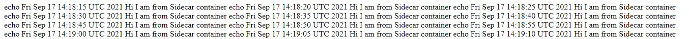

<link rel='stylesheet' href='../assets/css/main.css'/>

# Lab - Sidecar

## Overview

Sidecar containers are the containers that should run along with the main container in the pod. This sidecar pattern extends and enhances the functionality of current containers without changing it.
Nowadays, We know that we use container technology to wrap all the dependencies for the application to run anywhere. A container does only one thing and does that thing very well.

## Duration

20 minutes

```bash
$ cd ~/kubernets-labs/sidecar
```

## Step 1 - Deployment

inspect  [pods file](pods.yaml)

note that we have 2 containers,

```console
command: ["/bin/sh"]
args: ["-c", "while true; do echo echo $(date -u) 'Hi I am from Sidecar container' >> /var/log/index.html; sleep 5;done"]
name: sidecar-container
```

the command for our sidecar is to write some text into the `index.html` and our main container, which is an `nginx` server will read and serv that file

apply the file

```bash
$   kubectl apply -f pods.yaml
```

output

```console
pod/sidecar-container created
```

verify pods

```bash
$ kubectl get pods
```

output

```console
NAME                          READY   STATUS    RESTARTS   AGE
sidecar-container             2/2     Running   0          13s
```

this is the first time that we are seeing `2/2` in front of a pod, it means two containers are inside this pod and they are both up and running at the same time

## Step 2 - Service

expose the deployment using `LoadBalancer`

```bash
$   kubectl expose pods sidecar-container --port=80 --type=LoadBalancer
```

output will look like:

```console
service/sidecar-container exposed
```

verify

```bash
$   kubectl get svc
```

output

```console
NAME                 TYPE           CLUSTER-IP       EXTERNAL-IP       PORT(S)        AGE
kubernetes           ClusterIP      10.100.0.1       <none>            443/TCP        5h18m
sidecar-container    LoadBalancer   10.100.180.22    <EXTERNAL-URL>    80:32083/TCP   16s
```

Try to open the link in `EXTERNAL-IP` using your own browser.

**Note:**

- It could take upto 10 minutes to get `EXTERNAL-IP` and be able to open it.

result of the opening the link would look like:



## Well done! 👏